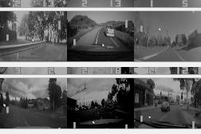

# Exploring state representations for offline RL

This repo contains most of the code for my Master's [Thesis](docs/Thesis.pdf) in the EEE department of [Imperial College London](https://imperial.ac.uk/).

## Abstract

Offline methods for reinforcement learning (RL) have the potential to turn large available datasets into strong decision-making systems and enable the use of RL in domains where learning through online interaction is too dangerous, costly or unethical. Moreover, online RL algorithms have been shown to benefit from compact and expressive state representations. To learn better representations, one can use self-supervised auxiliary objectives: they can help agents learn better policies, with fewer interactions, and with improved robustness against task-irrelevant information that is distracting. 

Recent research in offline methods has focused on algorithms to address the limitations of offline RL, such as distribution shift. We tackle the problem from a different angle and aim to answer the question: can current state representation learning (SRL) methods be used to learn better policies on offline data?

Through a set of experiments conducted on a new proposed benchmark (classic control with distractions) and Atari games, we show offline methods can perform drastically better in certain settings when combined with auxiliary SRL objectives, but highlight their sensitivity to tuning. We also aim to provide the reader with an understanding of some of the challenges and open questions that surround offline SRL.

## Documentation

- [Final Report](docs/Thesis.pdf): Master's Thesis.
- [Presentation](docs/Presentation.pdf): 15-minute presentation.
